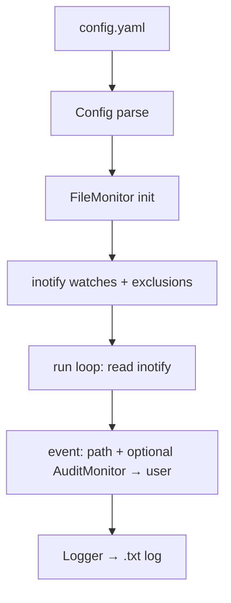

# BNP-project - File Monitor

Système de surveillance de fichiers en **C orienté objet**, sans bibliothèques tierces.
Utilise uniquement la **bibliothèque standard C** et l'API Linux **inotify** (sys/inotify.h).

## Fonctionnalités

- Surveillance des fichiers depuis la racine `/`
- Détection des modifications (write, create, delete, move, attrib)
- Log de tous les événements dans un fichier `.txt`
- Configuration via fichier `.yaml`
- Exclusions configurables (proc, sys, dev, etc.)

## Configuration (config.yaml)

```yaml
watch:
  - /                    # Chemins à surveiller

exclude:
  - /proc                # Chemins exclus
  - /sys
  - /dev
  - /run
  - /tmp

log_file: file_monitor.log
recursive: true
```

## Compilation

```bash
make or make -f Makefile.gnustep (obj C)
```

## Utilisation

### Modes principaux

```bash
# Avec config.yaml par défaut
./file_monitor                   # mode foreground

# Avec un fichier de config spécifique
./file_monitor config.yaml

# Lancer en daemon (pidfile dans build/file_monitor.pid)
./file_monitor start [config.yaml]

# Arrêter le daemon
./file_monitor stop

# Test local (sans root, surveille le répertoire courant)
make test-local
```

**Note :** Surveiller `/` requiert les droits root.

### Commandes dynamiques sur la watch-list (add / remove)

Il est possible **d'ajouter** ou **de supprimer** dynamiquement un chemin de la configuration via les commandes `add` et `remove`.

```bash
# Ajout
./file_monitor add bde-wits          # ajoute le home de l'utilisateur bde-wits
./file_monitor add 1234              # ajoute le répertoire courant du processus PID 1234
./file_monitor add /chemin/absolu    # ajoute directement un chemin
./file_monitor add bde-wits autre_config.yaml

# Suppression
./file_monitor remove bde-wits       # retire le home de bde-wits de watch
./file_monitor remove 1234           # retire le cwd du PID 1234 de watch
./file_monitor remove /chemin/absolu # retire directement un chemin
./file_monitor remove bde-wits autre_config.yaml
```

Pour ces deux commandes, le programme :

- **résout l'argument** en un chemin :
  - nom d'utilisateur → répertoire home (via `getpwnam_r`),
  - PID → répertoire courant du processus (`/proc/<pid>/cwd`),
  - chemin qui commence par `/` → utilisé tel quel ;
- **met à jour le fichier de config** (`config.yaml` ou celui passé en argument) :
  - `add` ajoute le chemin dans `watch` (sans doublon),
  - `remove` supprime le chemin de `watch` si présent ;
- **tente d'appliquer la règle côté auditd** via `auditctl` (si disponible) :
  - `add` appelle `auditd_add_watch(path)` (`auditctl -w path -p rw -k file_monitor`),
  - `remove` appelle `auditd_remove_watch(path)` (`auditctl -W path -k file_monitor`).

Les modifications de `watch` dans le fichier de configuration sont prises en compte au **prochain démarrage** du moniteur (foreground ou daemon).

## Limitations auditd sous WSL2

Sous **WSL2**, le sous-système d'audit Linux (`auditd`, `NETLINK_AUDIT`) n'est pas réellement disponible.
Pour cette raison, l'intégration avec `AuditMonitor` est **désactivée par défaut** dans `file_monitor.c`
(le bloc d'initialisation `auditd_create` et les appels `auditd_add_watch` sont commentés).

Sur un Linux natif où `auditd` est installé et fonctionne, vous pouvez **réactiver l'intégration audit** en
décommentant le bloc correspondant dans `file_monitor_init_impl` de `file_monitor.c`, puis en recompilant :

```c
// self->audit = auditd_create();
// if (self->audit) {
//     for (i = 0; i < cfg->watch_count; i++) {
//         if (!is_excluded(cfg, cfg->watch_paths[i]))
//             auditd_add_watch(cfg->watch_paths[i]);
//     }
// } else {
//     fprintf(stderr, "Warning: audit indisponible"
//             " (droits insuffisants ou auditd absent)\n");
// }
```

Une fois ce bloc réactivé et le binaire recompilé, les événements inotify pourront être corrélés avec les informations
d'utilisateur fournies par le sous-système d'audit, lorsqu'il est disponible.

## Structure (C orienté objet)

- `Config` – parseur YAML minimal, configuration
- `Logger` – log des événements dans un fichier txt
- `FileMonitor` – moniteur inotify avec méthodes init/run/stop/destroy

## Architecture



## Format du log

```
[2025-02-22 14:30:00] MODIFY | /path/to/file | 
[2025-02-22 14:30:01] CREATE | /path/newfile | 
[2025-02-22 14:30:02] CLOSE_WRITE | /path/modified | 
```